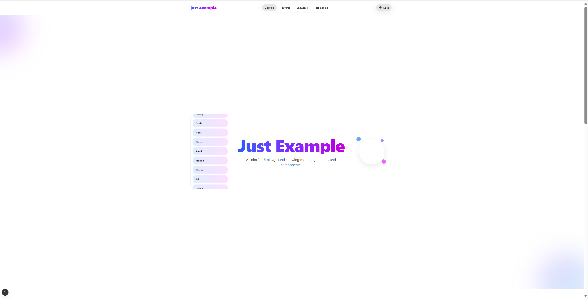
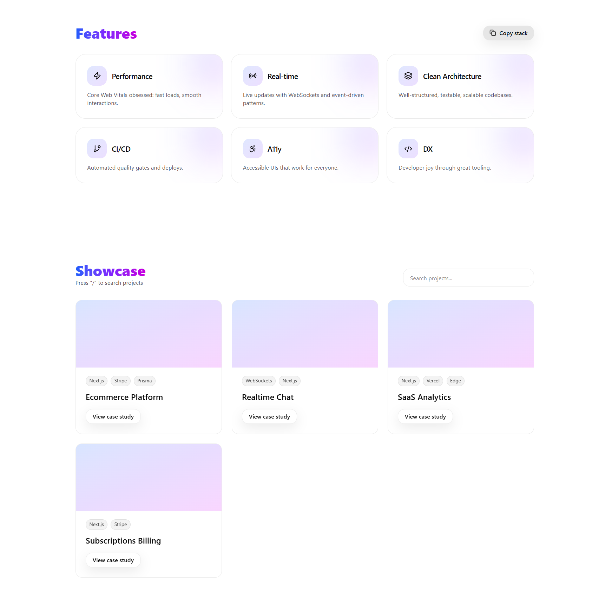

# Dev Showcase Landing (Next.js)

A single-page built with **Next.js (App Router)** and **TypeScript**. It showcases modern UI/UX (smooth scroll, dark mode, motion), clean code structure, and reusable components.

**Tech:** Next.js • TypeScript • TailwindCSS • (optional) shadcn/ui • framer-motion • lucide-react

---

## Features

- ⚡ Fast & accessible markup (semantic HTML, focus states)
- 🌓 Dark mode toggle (optional via `next-themes`)
- 🧭 Sticky navbar with smooth anchor scrolling + scroll progress
- 🎞️ Subtle motion on scroll (framer-motion)
- 🧩 Reusable UI components (Buttons, Cards, Dialog, etc.)
- 🔍 Basic SEO metadata via `app/layout.tsx` exports

---


### Desktop





## Getting Started

This is a [Next.js](https://nextjs.org) project bootstrapped with [`create-next-app`](https://nextjs.org/docs/app/api-reference/cli/create-next-app).

### Development

First, run the development server:

```bash
npm run dev
# or
yarn dev
# or
pnpm dev
# or
bun dev
